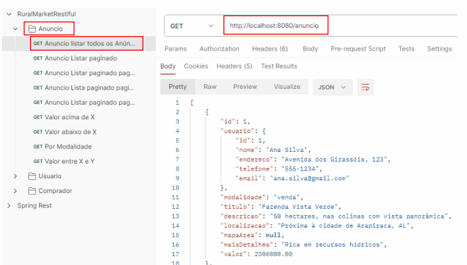

# 🚜 Rural Market Restful API

**Rural Market Restful API** é uma plataforma para comercialização de propriedades rurais, oferecendo funcionalidades para vendas, locações e leilões de fazendas, chácaras e outras propriedades do setor agrícola. Este projeto é desenvolvido em **Java** com **Spring Boot**, utilizando um banco de dados H2 embutido para armazenamento de dados. 

## 📋 Funcionalidades

### Gerenciamento de Anúncios

- Criação, edição e exclusão de anúncios de propriedades rurais.
- Suporte a diferentes modalidades, como venda, locação e leilão.

### Gestão de Usuários e Compradores

- Cadastro e autenticação de usuários.
- Gerenciamento de perfis e interações com compradores interessados.

### Feedback e Favoritos

- Coleta de feedbacks para melhorar os serviços.
- Sistema de favoritos para compradores marcarem anúncios de interesse.

### Mensagens e Comunicação

- Envio e recebimento de mensagens entre compradores e anunciantes.

## 🛠 Tecnologias Utilizadas

- **Java**: Linguagem principal para o desenvolvimento.
- **Spring Boot**: Framework para construção da API Restful.
- **H2 Database**: Banco de dados embutido para armazenamento e testes.
- **Maven**: Gerenciamento de dependências e build do projeto.
- **Postman**: Utilizado para testes das APIs (coleção incluída no projeto).
- **RESTful Services**: Arquitetura para comunicação entre cliente e servidor.

## 📱 Uso

Este projeto foi estruturado para atender às necessidades do setor agrícola com uma API amigável e extensível, possibilitando integração com aplicativos móveis ou sistemas web.

### Como Executar

1. Clone o repositório:
   
   ```
   git clone https://github.com/andrei-schievelbein/rural-market-restful-api.git
   ```
2. Abra o projeto no Intellij ou IDE de sua preferência.
3. Compile e execute.

## 📝 Testando a API

A coleção Postman incluída no projeto (**Postman_collection2.1.json**) pode ser importada para testar as rotas e funcionalidades disponíveis. Exemplos estão inclusos no arquivo (**WebServices em RESTful.pdf**)

## 🎲 Banco de dados H2

Para fins de testes, o banco de dados é automaticamente populado ao rodar a aplicação.

## 📷 Screenshots



## 💡 Contribuições

Contribuições são bem-vindas! Sinta-se à vontade para abrir issues ou enviar pull requests.

### Feito por Andrei Schievelbein | [🌐LinkedIn](https://www.linkedin.com/in/andrei-schievelbein/)

---
